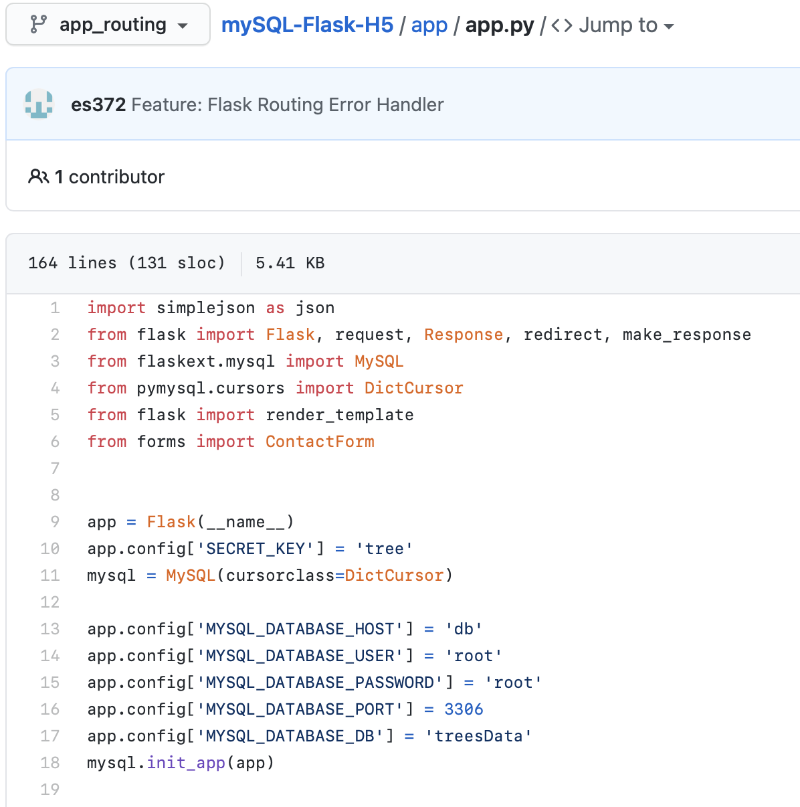
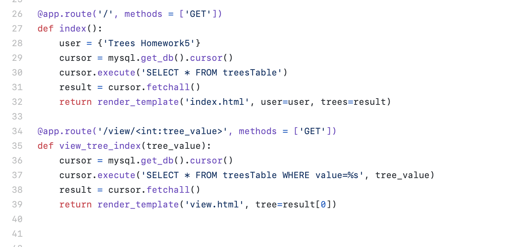
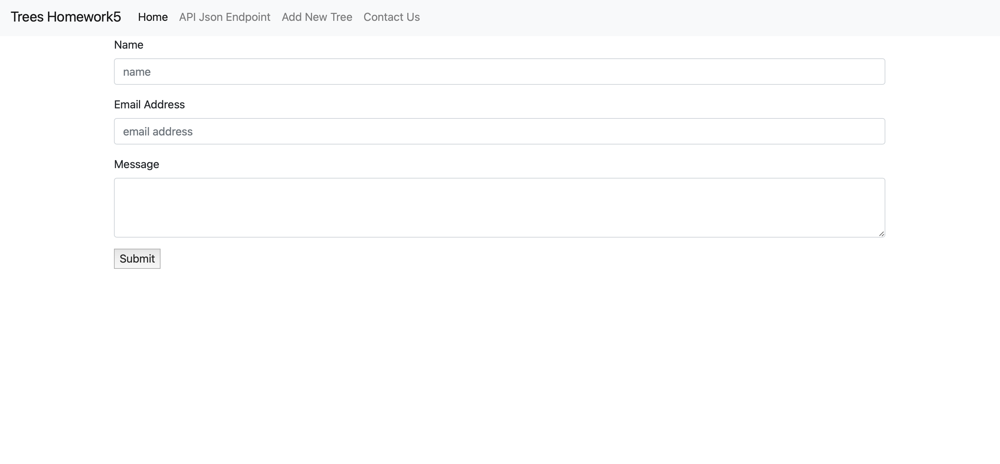
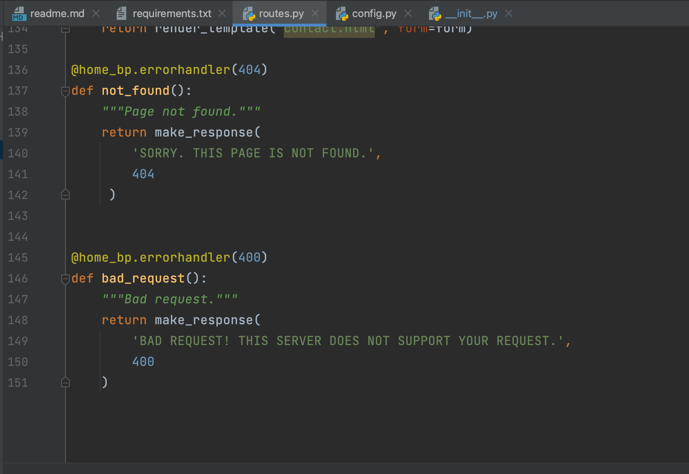
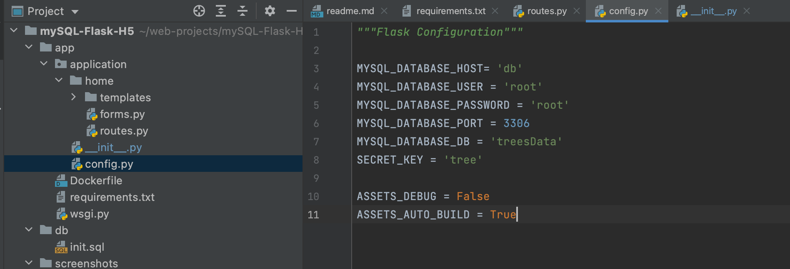
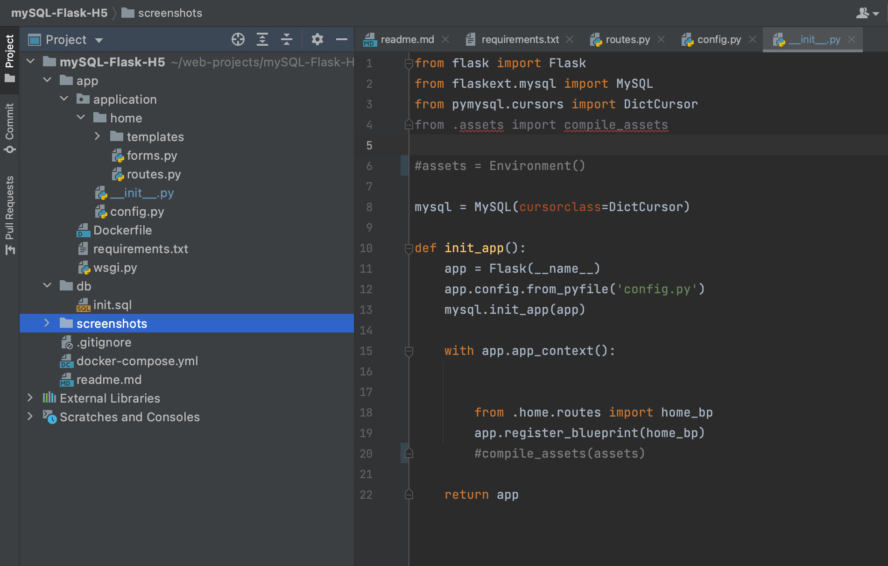
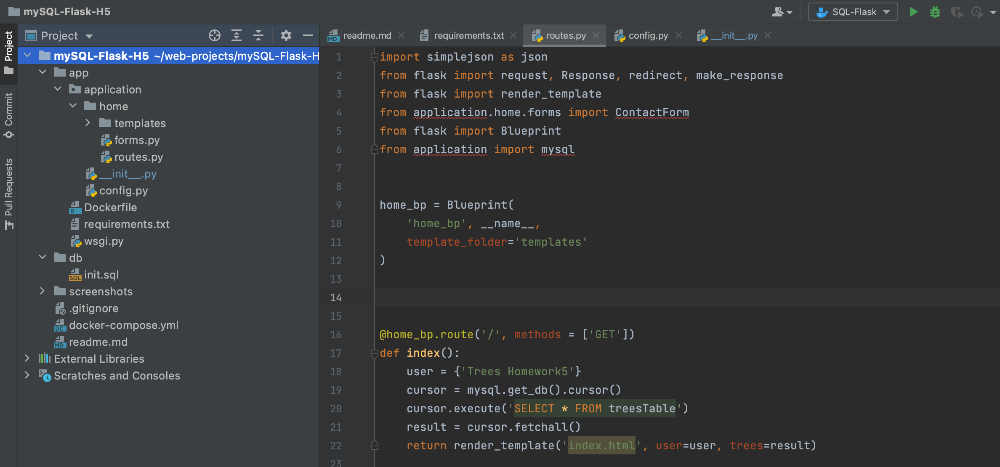
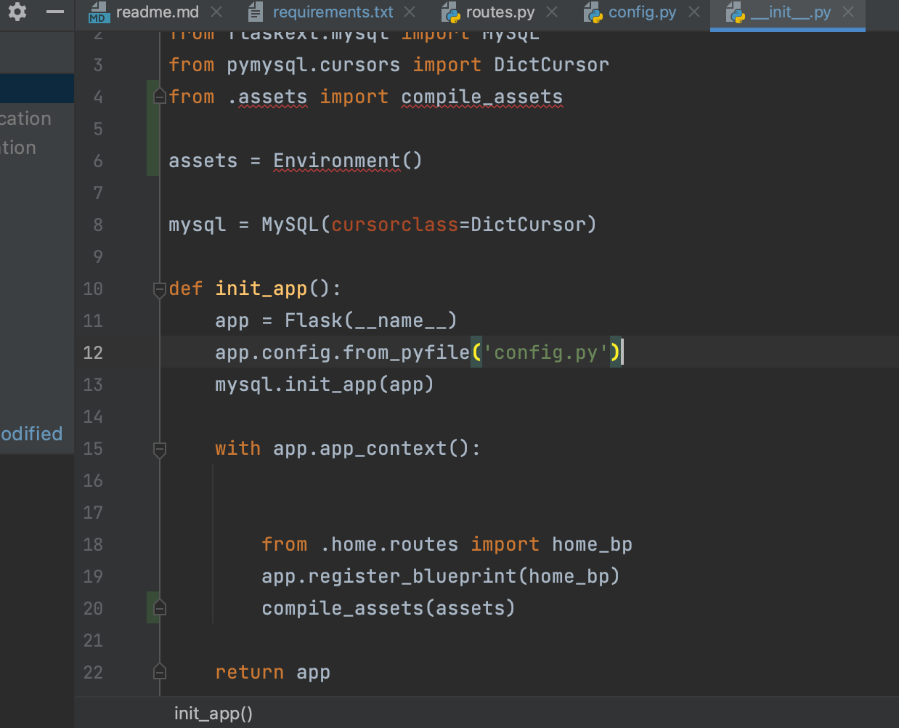

PROPERLY MANAGING TREE DATABASE MODEL WITH FLASK-MYSQL, DOCKER, AND PYTHON

The tutorial went over how to properly structure and code flask applications with a database model. The project assignment involved
updating our current applications with the goal of learning correct practices when managing our data application. 

Here are some of the systems/tools that my project uses:
- Bootstrap CSS
- Flask
- Flask-MySQL
- Pycharm
- JSON
- Docker
- Python
- Flask-WTF
- Jinja2
- Blueprints
- Flask-Assets

The tutorial uses different systems such as SQLAlchemy and stylesheets. So I implemented the systems in my project accordingly with
the instructions of the tutorials to achieve the same goal, by researching how to solve the problems I encountered in doing so. Being
that my application uses different systems, here is a general overview on how I updated my project:

1. Routing my flask application to handle errors
2. Download and import Flask-WTF modules
3. Configuring my flask app with secret keys for WTForms
4. Create contact form in tree application
5. Relocating Configuration in separate file (no inline configuration)
6. Project restructure for application factory pattern
7. Initiate Flask in __init__.py
8. Create application context
9. Create app's entry point(wsgi.py)
10. Get rid of app.py and implement single responsibility principle
11. Create routes.py for application routing
12. Add blueprint configuration to routes.py
13. create global variable of mysql for cursor in __init__.py (Database functionality)
14. Connect Flask to MySQL
15. Implement Flask structure with home blueprint
16. Register Home Blueprint in __init__.py
17. Fix Jinja2 routing with Home Blueprint
18. Download flask asset modules
19. Set up project for blueprint specific asset compiling
20. Test application functionality using Docker

After reading the tutorial, I realized my current application may work, however, it was nowhere near the quality a Flask application
needs to be. Thus, I learned a lot about the best methods to manage a flask application with a database.

Here are Screenshots of the steps I have completed:

Step 1:

Step 2:

Step 3:

Step 4:

Step 5:

Step 6:

Step 7: 

Step 8:

