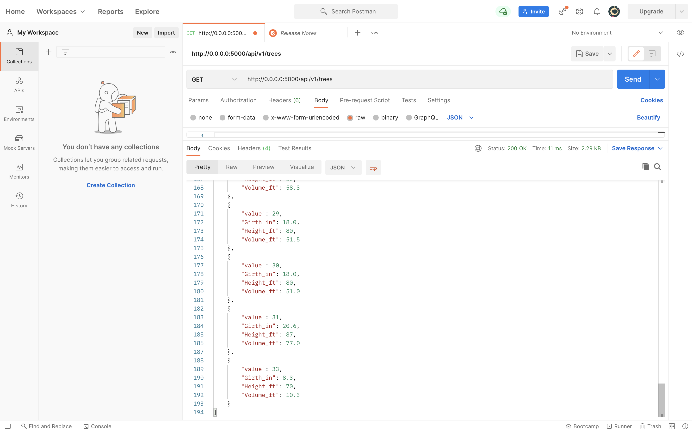

###Tree Web App

Postman all records:

Postman single record:

Postman creating a record and result in record listing:

Postman editing a record and result in record listing:

Postman deleting a record and result in record listing:

